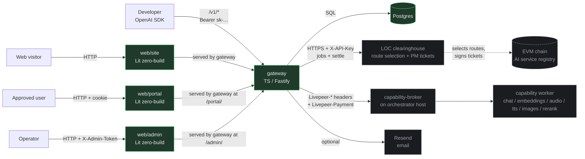
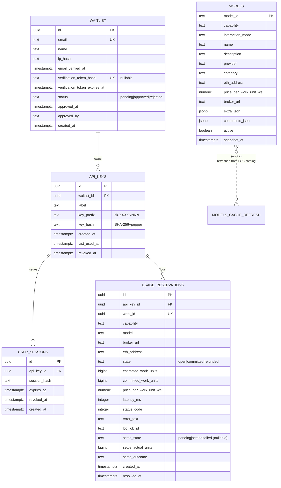
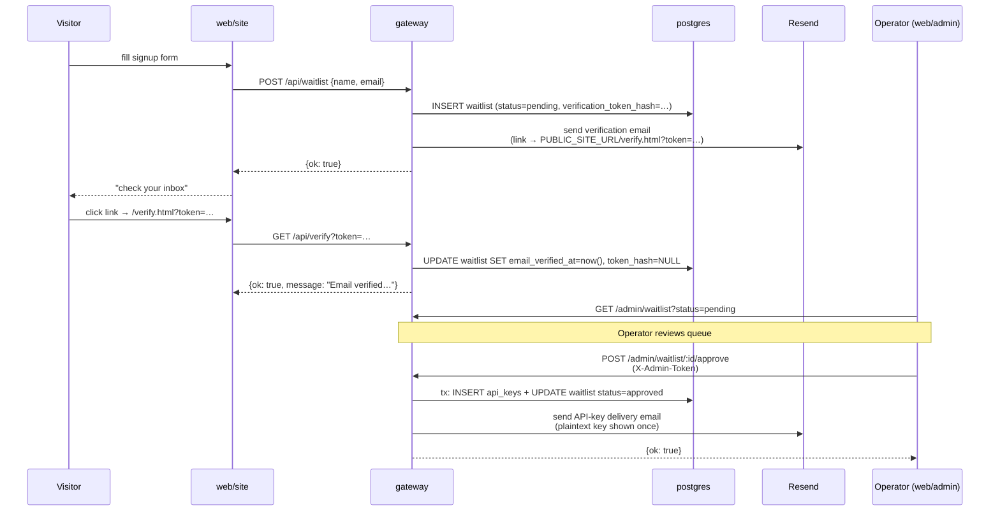
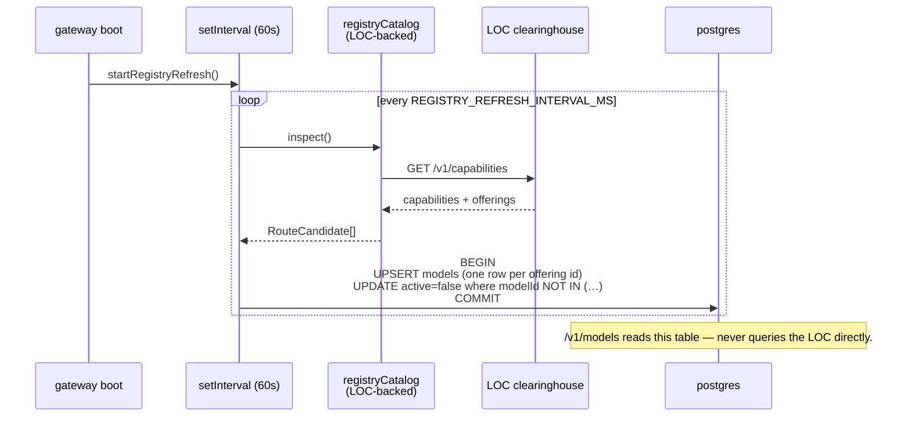
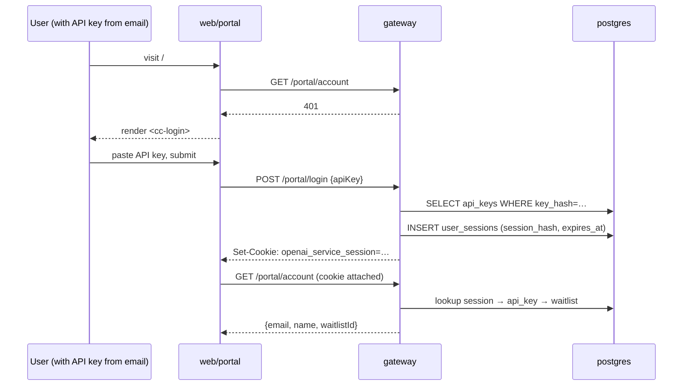
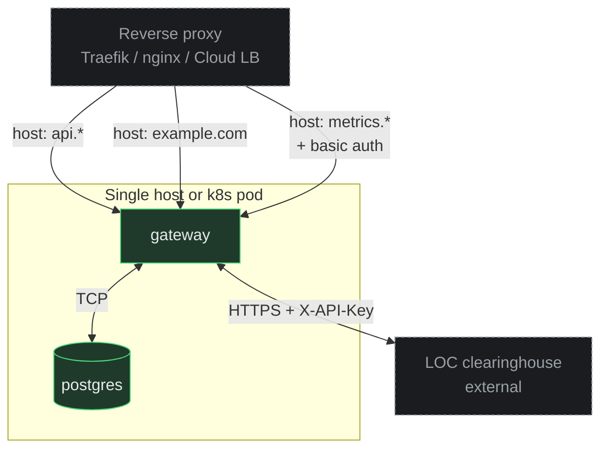

# ARCHITECTURE

Top-level map of the repository. Follows the
[ARCHITECTURE.md convention](https://matklad.github.io/2021/02/06/ARCHITECTURE.md.html):
this file is for *bird's-eye orientation*. Deeper detail lives in
[`docs/design-docs/`](./docs/design-docs/) and in each
file's docstring.

For "what does this thing do?" see [`DESIGN.md`](./DESIGN.md).
For invariants, see
[`docs/design-docs/core-beliefs.md`](./docs/design-docs/core-beliefs.md).

---

## 1. System overview



Green = in this repo. Dashed gray = external runtime peers (run as
their own containers / on other hosts).

---

## 2. Components

| Component | Path | Purpose | Owns |
|---|---|---|---|
| **Gateway** | `gateway/` | Translates OpenAI requests → Livepeer wire. Hosts the SaaS shell (waitlist, sessions, API keys, admin). | The only stateful service in this repo (besides Postgres). |
| **Marketing site** | `web/site/` | Public landing + waitlist signup + email-verification page. | Generic copy; rebrand at deploy time. |
| **Portal** | `web/portal/` | Authenticated user dashboard: account, API keys, usage. | Cookie-session UX. |
| **Admin** | `web/admin/` | Operator console: waitlist queue, users, usage, LOC + catalog debug. | `X-Admin-Token` UX (stored in localStorage). |

Route selection and payment minting are delegated to the **LOC —
Livepeer Open Clearinghouse**, an external HTTP service
(`https://loc.cloudspe.com` by default) reached with an `X-API-Key`
header. The gateway opens a job per `/v1/*` request and settles actual
usage afterwards. The LOC owns chain access and the pooled wallet that
signs payment (PM) tickets; this repo holds no keys and never talks to
the chain. The LOC is **not** in this repository and is not part of the
compose stack.

---

## 3. Gateway internal layering

```
            ┌────────────────────────────────────────────┐
            │ index.ts / server.ts  (app wiring)         │
            ├────────────────────────────────────────────┤
            │ routes/{public,portal,admin}/  proxy/      │  ← HTTP surface
            ├────────────────────────────────────────────┤
            │ loc/  proxy/livepeer/  email/              │  ← service / wire
            ├────────────────────────────────────────────┤
            │ repo/  schema/  registry/                  │  ← data / catalog
            ├────────────────────────────────────────────┤
            │ config.ts  db.ts  crypto.ts  metrics.ts    │  ← primitives
            └────────────────────────────────────────────┘
```

Edges go *down* only. Cross-cutting concerns (config, db pool,
email client, LOC client, rate limiter) are bundled into
`ServerDeps` in `index.ts` and threaded to every handler via
`app.decorate('deps', deps)` on the Fastify instance. Handlers read
them via `app.deps`. Enforcement is `tsc` + reviewer attention; a
mechanical import-graph linter is on the tech-debt tracker.

### Source-of-truth split

| Subtree | Origin | Notes |
|---|---|---|
| `proxy/livepeer/` | Copied verbatim from upstream `livepeer-network-modules/openai-gateway/` | Load-bearing wire mechanics — streaming usage parsing, broker dispatch over the http-reqresp/http-stream/http-multipart modules. Don't churn. |
| `loc/` (`client.ts`, `dispatch.ts`, `settler.ts`) | Hand-written in this repo | Typed HTTP client for the LOC, the per-request job open → dispatch → settle flow, and the durable background settler. Replaced the deleted `proxy/service/` route selector + `proxy/livepeer/payment.ts`. |
| `proxy/{chat,embeddings,audio-speech,audio-transcriptions,images}.ts` | Adapted from upstream | Stripped of `customer-portal` + `chatBilling`/`nonChatBilling`; rewired to local `apiKeys` + `usage_reservations`. |
| `proxy/rerank.ts` | Ported from an earlier Rust implementation of the same surface | TS reimplementation. |
| Everything else (`routes/`, `repo/`, `schema/`, `crypto.ts`, `email/`, `metrics.ts`, `db.ts`, `config.ts`, `server.ts`, `index.ts`) | Hand-written in this repo | Built directly for this repository. |

---

## 4. Data storage



**One Postgres database. One migration track.** `gateway/migrations/`
holds numbered `.sql` files applied in order at boot by a
home-grown runner (`gateway/src/db.ts`). The current shape is
`0001_initial.sql` through `0004_loc_settlement.sql` (the last adds the
`loc_job_id` / `settle_state` / `settle_actual_units` / `settle_outcome`
columns that drive the durable settler).

### Why the state machine on `usage_reservations`

v1 has no customer billing math, so `open → committed | refunded` is
purely observational. The same DB write that commits or refunds a
reservation also enqueues a durable **settle intent**
(`settle_state='pending'` + `settle_actual_units`), which the background
settler drains by calling the LOC. The schema is intentionally
forward-compatible: when customer billing lands, the same rows + state
machine can carry money math without a schema change.

### Why a `models` cache table

`/v1/models` must be cheap. Calling the LOC catalog on every request
would couple catalog reads to LOC availability + add latency to every
`models` request. The background refresh task (every
`REGISTRY_REFRESH_INTERVAL_MS`, default 60s) reads the LOC
`GET /v1/capabilities`, flattens it, and writes the latest snapshot into
`models`; the HTTP handler reads from there. Stale rows get
`active=false` so disappearance is reflected within one refresh. Display
metadata is operator-override only; the model id is the LOC offering id.

---

## 5. Process flows

### 5.1 Signup → verify → approve → key



### 5.2 `/v1/*` request lifecycle

```mermaid
sequenceDiagram
  participant C as OpenAI SDK client
  participant GW as gateway
  participant DB as postgres
  participant LOC as LOC clearinghouse
  participant BRK as capability-broker
  participant RNR as runner
  participant SET as settler (background)

  C->>GW: POST /v1/chat/completions<br/>Authorization: Bearer sk-…
  GW->>DB: SELECT api_keys WHERE key_hash=…
  Note over GW,DB: 401 if missing/revoked/unapproved
  GW->>DB: INSERT usage_reservations (state='open', work_id)
  GW->>LOC: POST /v1/jobs {capability, offering, estimated_units}
  Note over LOC: selects a route AND mints the payment<br/>envelope; charges the estimate to the<br/>operator's credit balance
  LOC-->>GW: {job_id, broker_url, mode, payment_envelope, …}
  GW->>BRK: POST broker_url<br/>Livepeer-Capability, Livepeer-Payment, …
  BRK->>RNR: forward request
  RNR-->>BRK: response (SSE stream or unary)
  BRK-->>GW: response

  alt success
    GW->>DB: UPDATE usage_reservations<br/>state='committed', committed_work_units=…,<br/>loc_job_id, settle_state='pending'
    GW-->>C: response (200, SSE or JSON)
  else upstream failure
    GW->>DB: UPDATE usage_reservations<br/>state='refunded', error_text=…,<br/>settle_state='pending' (0 units)
    GW-->>C: OpenAI-shaped error<br/>(502/500)
  end

  Note over GW,LOC: on LOC mode mismatch the gateway settles 0<br/>(outcome 'mode_mismatch') and re-opens a job<br/>(LOC_JOB_RETRIES retries)

  loop every LOC_SETTLE_INTERVAL_MS
    SET->>DB: SELECT pending settle intents
    SET->>LOC: POST /v1/jobs/{id}/settle {actual_units, outcome}
    LOC-->>SET: refunds the unused part of the estimate
    SET->>DB: settle_state='settled' (409/404 are terminal successes)
  end
```

### 5.3 Catalog refresh



### 5.4 Portal cookie auth



---

## 6. External dependencies

| What | How it talks to us |
|---|---|
| OpenAI SDK clients | HTTPS → `/v1/*` |
| Portal / admin / site users | HTTPS → static SPAs + JSON APIs |
| LOC clearinghouse | HTTPS + `X-API-Key` (`LOC_BASE_URL`); jobs + settle + capabilities |
| `capability-broker` (on orch host) | HTTPS, per the Livepeer wire spec (broker URL comes from the LOC job) |
| Postgres | TCP, single DB for all SaaS data |
| Resend | HTTPS, email delivery (optional in dev) |
| EVM chain (Arbitrum One by default) | Indirectly — only via the LOC, which owns chain access and the PM-ticket wallet |

---

## 7. Boundaries that matter

- **The proxy doesn't know about humans.** `/v1/*` authenticates via
  API key and joins to `usage_reservations.api_key_id`. Names + emails
  live in `waitlist`. The only join between the two namespaces is
  `api_keys.waitlist_id`.
- **The wire spec is product-agnostic.** `proxy/livepeer/` only knows
  `Livepeer-Capability` headers + interaction modes. Mapping OpenAI →
  capability happens in the per-endpoint handlers
  (`proxy/{chat,embeddings,…}.ts`).
- **The SaaS shell is product-agnostic.** Auth, waitlist, sessions,
  admin could be reused for a different inference surface. OpenAI
  specifics live entirely in `proxy/`.
- **Runners don't import from the gateway and vice versa.** The only
  contract between them is the HTTP capability endpoint a runner
  exposes, mediated by the broker. Either could be deleted without
  breaking the other.

---

## 8. Observability

- **Prometheus** `/metrics` on the gateway, optionally Bearer-gated
  via `METRICS_TOKEN`. Surfaces:
  - Default Node process metrics (heap, GC, event-loop lag) under
    prefix `openai_service_*`
  - HTTP: `openai_service_http_requests_total{method,route,status}`,
    `openai_service_http_request_duration_seconds`
  - Proxy: `openai_service_proxy_reservations_total{capability,outcome}`
  - Settler: `openai_service_proxy_settle_total{outcome}`
  - Waitlist: `openai_service_waitlist_signups_total`
- **Structured JSON logs** to stdout via Fastify's pino logger.
  Request IDs propagated as `Livepeer-Request-Id` on `/v1/*`.
- **`usage_reservations`** is the durable per-request log (queryable
  via `/admin/usage` and `/portal/usage`).

---

## 9. Deployment shape



The compose stack is just `db` + `gateway` — no daemon sidecars, no
unix-socket volumes. In dev, the same shape holds: `docker compose up -d`
runs gateway + db; each SPA runs via its own `dev-server.js`, serving its
checked-in files locally and proxying API traffic back to the gateway.

---

## 10. Out of scope here

- The Livepeer wire spec itself — owned by `livepeer-network-protocol`
  in the source monorepo.
- The on-chain service registry contracts — operated separately.
- Production deployment infra (Grafana, Prometheus, Traefik configs)
  — deferred; will land under `infra/` later (tracked in
  `docs/exec-plans/tech-debt-tracker.md` when prioritized).
- The LOC clearinghouse itself — route selection, the pooled
  PM-ticket wallet, and chain access are owned by the LOC, not this
  repo. `make loc-smoke` exercises a real job open + settle against it.
- Real upstream proxying validation — needs a real `capability-broker`.
  Everything up to and including the broker call is unit-tested via the
  smoke flow.
