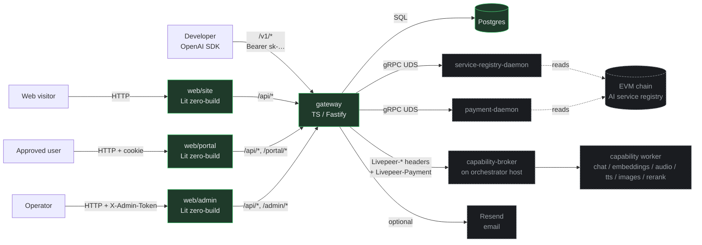
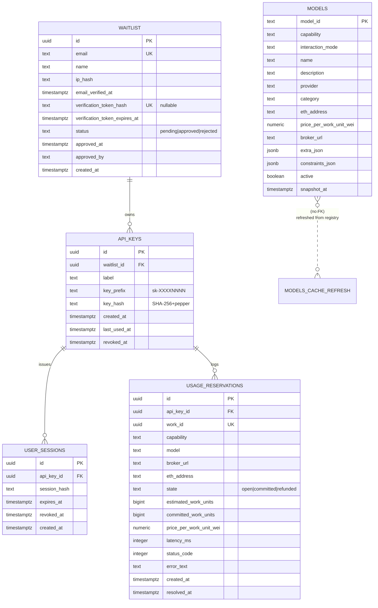
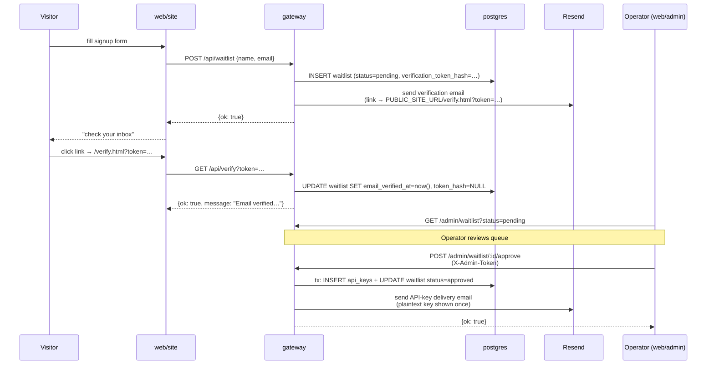
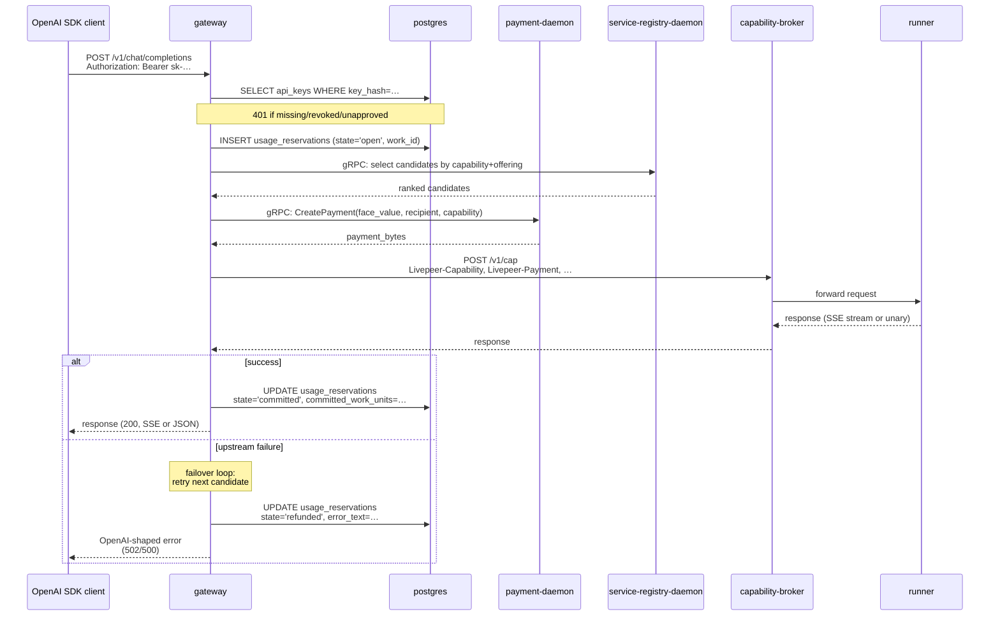
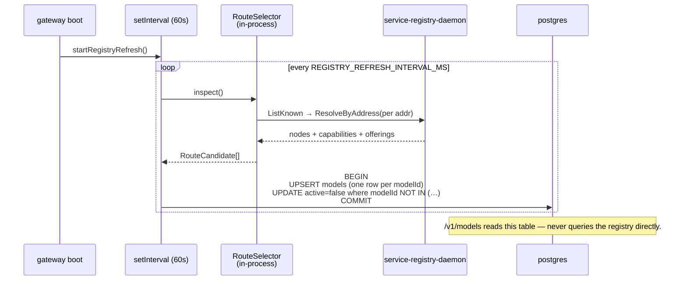
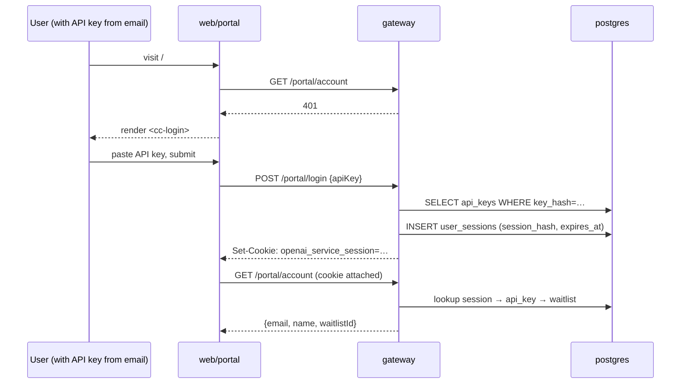
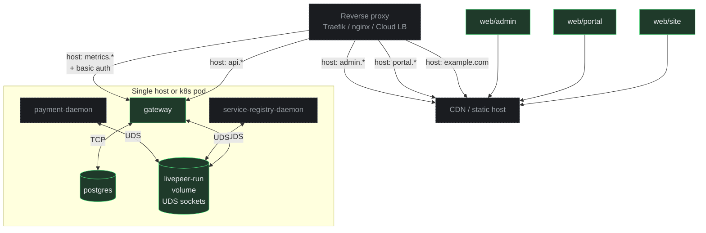

# ARCHITECTURE

Top-level map of the repository. Follows the
[ARCHITECTURE.md convention](https://matklad.github.io/2021/02/06/ARCHITECTURE.md.html):
this file is for *bird's-eye orientation*. Deeper detail lives in
[`docs/design-docs/`](./docs/design-docs/) and in each
file's docstring.

For "what does this thing do?" see [`DESIGN.md`](./DESIGN.md).
For invariants, see
[`docs/design-docs/core-beliefs.md`](./docs/design-docs/core-beliefs.md).

---

## 1. System overview



Green = in this repo. Dashed gray = external runtime peers (run as
their own containers / on other hosts).

---

## 2. Components

| Component | Path | Purpose | Owns |
|---|---|---|---|
| **Gateway** | `gateway/` | Translates OpenAI requests → Livepeer wire. Hosts the SaaS shell (waitlist, sessions, API keys, admin). | The only stateful service in this repo (besides Postgres). |
| **Marketing site** | `web/site/` | Public landing + waitlist signup + email-verification page. | Generic copy; rebrand at deploy time. |
| **Portal** | `web/portal/` | Authenticated user dashboard: account, API keys, usage. | Cookie-session UX. |
| **Admin** | `web/admin/` | Operator console: waitlist queue, users, usage, registry debug. | `X-Admin-Token` UX (stored in localStorage). |
| **Protos** | `proto/` | Vendored gRPC definitions for `payment-daemon` + `service-registry-daemon`. | Loaded at runtime by the gateway. |

The two Livepeer daemons (`service-registry-daemon`,
`payment-daemon`) are pulled as official Docker images
(`tztcloud/livepeer-*-daemon`) and run alongside the gateway in the
`livepeer` compose profile. They are **not** in this repository.

---

## 3. Gateway internal layering

```
            ┌────────────────────────────────────────────┐
            │ index.ts / server.ts  (app wiring)         │
            ├────────────────────────────────────────────┤
            │ routes/{public,portal,admin}/  proxy/      │  ← HTTP surface
            ├────────────────────────────────────────────┤
            │ proxy/service/  proxy/livepeer/  email/    │  ← service / wire
            ├────────────────────────────────────────────┤
            │ repo/  schema/  registry/                  │  ← data / RPC
            ├────────────────────────────────────────────┤
            │ config.ts  db.ts  crypto.ts  metrics.ts    │  ← primitives
            └────────────────────────────────────────────┘
```

Edges go *down* only. Cross-cutting concerns (config, db pool,
email client, route selector, rate limiter) are bundled into
`ServerDeps` in `index.ts` and threaded to every handler via
`app.decorate('deps', deps)` on the Fastify instance. Handlers read
them via `app.deps`. Enforcement is `tsc` + reviewer attention; a
mechanical import-graph linter is on the tech-debt tracker.

### Source-of-truth split

| Subtree | Origin | Notes |
|---|---|---|
| `proxy/livepeer/`, `proxy/service/` | Copied verbatim from upstream `livepeer-network-modules/openai-gateway/` | Load-bearing wire mechanics — streaming usage parsing, payment minting, failover. Don't churn. |
| `proxy/service/genericRouteHealth.ts` | Inlined upstream `gateway-route-health` package | The TS class + Prometheus renderer. |
| `proxy/{chat,embeddings,audio-speech,audio-transcriptions,images}.ts` | Adapted from upstream | Stripped of `customer-portal` + `chatBilling`/`nonChatBilling`; rewired to local `apiKeys` + `usage_reservations`. |
| `proxy/rerank.ts` | Ported from an earlier Rust implementation of the same surface | TS reimplementation. |
| Everything else (`routes/`, `repo/`, `schema/`, `crypto.ts`, `email/`, `metrics.ts`, `db.ts`, `config.ts`, `server.ts`, `index.ts`) | Hand-written in this repo | Built directly for this repository. |

---

## 4. Data storage



**One Postgres database. One migration track.** `gateway/migrations/`
holds numbered `.sql` files applied in order at boot by a
home-grown runner (`gateway/src/db.ts`). The current shape is the
single migration `0001_initial.sql`.

### Why the state machine on `usage_reservations`

v1 has no billing math, so `open → committed | refunded` is purely
observational. The schema is intentionally forward-compatible: when
billing lands, the same rows + state machine can carry money math
without a schema change.

### Why a `models` cache table

`/v1/models` must be cheap. Querying the gRPC resolver on every call
would couple catalog reads to chain availability + add 100ms+ to
every `models` request. The background refresh task (every
`REGISTRY_REFRESH_INTERVAL_MS`, default 60s) writes the latest
snapshot into `models`; the HTTP handler reads from there. Stale rows
get `active=false` so disappearance is reflected within one refresh.

---

## 5. Process flows

### 5.1 Signup → verify → approve → key



### 5.2 `/v1/*` request lifecycle



### 5.3 Registry refresh



### 5.4 Portal cookie auth



---

## 6. External dependencies

| What | How it talks to us |
|---|---|
| OpenAI SDK clients | HTTPS → `/v1/*` |
| Portal / admin / site users | HTTPS → static SPAs + JSON APIs |
| `service-registry-daemon` | gRPC over UDS (`/var/run/livepeer/service-registry.sock`) |
| `payment-daemon` | gRPC over UDS (`/var/run/livepeer/payer-daemon.sock`) |
| `capability-broker` (on orch host) | HTTPS, per the Livepeer wire spec |
| Postgres | TCP, single DB for all SaaS data |
| Resend | HTTPS, email delivery (optional in dev) |
| EVM chain (Arbitrum One by default) | Indirectly — only via the two daemons |

---

## 7. Boundaries that matter

- **The proxy doesn't know about humans.** `/v1/*` authenticates via
  API key and joins to `usage_reservations.api_key_id`. Names + emails
  live in `waitlist`. The only join between the two namespaces is
  `api_keys.waitlist_id`.
- **The wire spec is product-agnostic.** `proxy/livepeer/` only knows
  `Livepeer-Capability` headers + interaction modes. Mapping OpenAI →
  capability happens in the per-endpoint handlers
  (`proxy/{chat,embeddings,…}.ts`).
- **The SaaS shell is product-agnostic.** Auth, waitlist, sessions,
  admin could be reused for a different inference surface. OpenAI
  specifics live entirely in `proxy/`.
- **Runners don't import from the gateway and vice versa.** The only
  contract between them is the HTTP capability endpoint a runner
  exposes, mediated by the broker. Either could be deleted without
  breaking the other.

---

## 8. Observability

- **Prometheus** `/metrics` on the gateway, optionally Bearer-gated
  via `METRICS_TOKEN`. Surfaces:
  - Default Node process metrics (heap, GC, event-loop lag) under
    prefix `openai_service_*`
  - HTTP: `openai_service_http_requests_total{method,route,status}`,
    `openai_service_http_request_duration_seconds`
  - Proxy: `openai_service_proxy_reservations_total{capability,outcome}`
  - Waitlist: `openai_service_waitlist_signups_total`
  - Route health (from `gateway-route-health` renderer):
    `livepeer_gateway_route_health_*`
- **Structured JSON logs** to stdout via Fastify's pino logger.
  Request IDs propagated as `Livepeer-Request-Id` on `/v1/*`.
- **`usage_reservations`** is the durable per-request log (queryable
  via `/admin/usage` and `/portal/usage`).

---

## 9. Deployment shape



In dev, the same shape collapses: `docker compose up -d` runs gateway
+ db; each SPA runs via its own `dev-server.js` with a path-prefix
proxy to the gateway.

---

## 10. Out of scope here

- The Livepeer wire spec itself — owned by `livepeer-network-protocol`
  in the source monorepo.
- The on-chain service registry contracts — operated separately.
- Production deployment infra (Grafana, Prometheus, Traefik configs)
  — deferred; will land under `infra/` later (tracked in
  `docs/exec-plans/tech-debt-tracker.md` when prioritized).
- Real upstream proxying validation — needs a real
  `capability-broker` + `payment-daemon`. Everything up to and
  including the broker call is unit-tested via the smoke flow.
