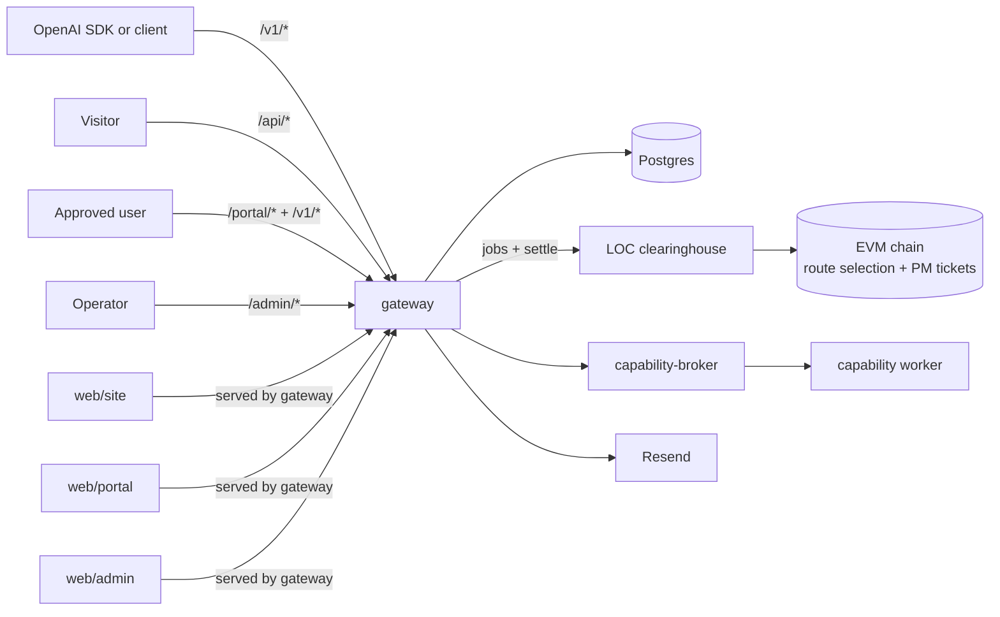
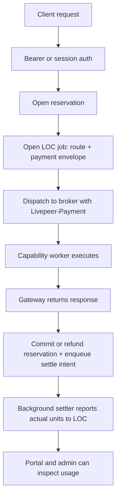
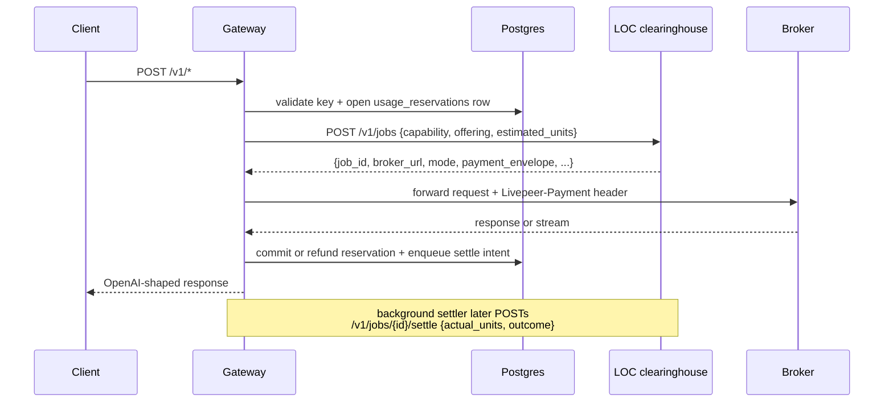
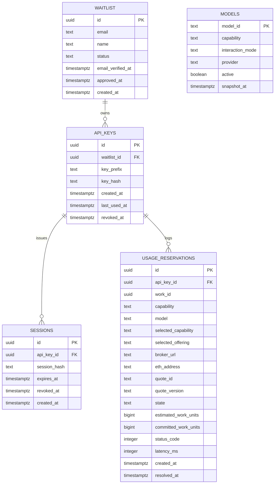

# OpenAI Service

An OpenAI-compatible inference gateway and SaaS shell built on top of
the [Livepeer](https://livepeer.org/) network and the
[livepeer-network-modules](https://github.com/Cloud-SPE/livepeer-network-modules)
framework.

This repository is both:
- a working application
- a reference implementation / demo of how to build against Livepeer
  network capabilities through the **LOC — Livepeer Open Clearinghouse**
  HTTP API and the broker wire surface from `livepeer-network-modules`

The core idea is simple: keep the OpenAI client surface familiar, but
route work through Livepeer's capability marketplace. The LOC owns route
selection and payment minting; the gateway opens a job per request and
forwards it to the broker the LOC picks.

Agents should start at [AGENTS.md](./AGENTS.md). Humans can use this
README as the main overview.

## What This Repo Is

This repo contains:
- `gateway/`: one TypeScript Fastify service that hosts:
  - the OpenAI-compatible `/v1/*` API
  - a waitlist / verify / approve / API-key shell
  - portal and admin backend routes
  - production serving for `web/site`, `web/portal`, and `web/admin`
  - a typed HTTP client for the LOC clearinghouse
- `web/site/`: zero-build Lit marketing and waitlist site
- `web/portal/`: zero-build Lit user portal with account, keys, health,
  playground, and usage
- `web/admin/`: zero-build Lit admin with waitlist, users, usage,
  health, and registry diagnostics

This repo holds no chain keys and never talks to the chain directly. It
delegates route selection and payment minting to the **LOC — Livepeer
Open Clearinghouse** (`https://loc.cloudspe.com` by default), reached
over HTTPS with an `X-API-Key` header.

## Why It Exists

This project demonstrates a practical application architecture for the
Livepeer network:
- discover capabilities from the LOC clearinghouse
- open a job per request — the LOC selects a route AND mints the
  payment envelope in one call
- forward OpenAI-shaped requests to the broker the LOC returns
- settle actual usage afterwards so the LOC refunds the unused part of
  each estimate
- preserve enough job / route metadata for auditing and debugging

It is intentionally opinionated:
- clearinghouse-mediated only
- no daemon sidecars, no local chain keys
- no static overlay routing
- no local hardcoded model catalog
- no local fallback broker path

## AI Harness Approach

This repo follows an agent-first harness model:
- the repository is the system of record
- plans live in the repo
- architecture is documented as executable invariants, not tribal lore
- the codebase is designed to be navigable by both humans and coding
  agents

The working style is:
- humans provide intent, constraints, and approval
- agents inspect the current repo state, make changes, run checks, and
  keep the work grounded in checked-in artifacts
- docs, code, and deployment surfaces are expected to move together

Relevant references:
- [AGENTS.md](./AGENTS.md)
- [docs/references/openai-harness-engineer.md](./docs/references/openai-harness-engineer.md)
- [docs/design-docs/core-beliefs.md](./docs/design-docs/core-beliefs.md)

## High-Level Architecture



## Data Flow



## Process Flow



## Data Model



## Repo Structure

| Path | Purpose |
|---|---|
| [gateway/](./gateway/) | TypeScript backend, routing, auth, usage tracking, LOC client |
| [web/site/](./web/site/) | Marketing site and waitlist signup |
| [web/portal/](./web/portal/) | User portal and playground |
| [web/admin/](./web/admin/) | Operator/admin UI |
| [docs/](./docs/) | Design docs, product specs, exec plans |

## Application Architecture

### Gateway responsibilities

The gateway is the center of the system. It:
- exposes OpenAI-compatible endpoints
- validates API keys and portal/admin credentials
- opens, commits, and refunds usage reservations
- opens a LOC job per request (the LOC selects the route AND mints the
  payment envelope)
- forwards requests to the broker the LOC returns
- settles actual usage back to the LOC via a durable background task
- stores a cached public model catalog in Postgres

### UI responsibilities

The three `web/` apps are zero-build Lit SPAs:
- `site`: onboarding and verification
- `portal`: user-facing account, keys, network health, playground, and
  usage
- `admin`: waitlist management, user inspection, usage, network health,
  and LOC / catalog diagnostics

### Catalog vs hot-path routing

There are two distinct paths:
- hot-path routing:
  request-time `POST /v1/jobs` to the LOC, which returns a single
  route plus its payment envelope
- catalog/debug path:
  background refresh from the LOC `GET /v1/capabilities` into the
  `models` table for `/v1/models` and diagnostics

That split is intentional. Request routing must go through the LOC so
selection and payment stay consistent. Public catalog reads must stay
cheap and cacheable.

### Model identity

The model id is the LOC offering id. `/v1/models` rows are built from
the LOC capability catalog; the gateway no longer maps user-facing
aliases onto internal offering keys. Display metadata (name,
description, provider, category) is populated only by operator
overrides — it is not catalog-sourced.

### Supported API surface

Current v1 surface:
- `POST /v1/chat/completions`
- `POST /v1/embeddings`
- `POST /v1/images/generations`
- `POST /v1/audio/speech`
- `POST /v1/audio/transcriptions`
- `POST /v1/rerank`
- `GET /v1/models`

## Configuration

The runtime is env-driven. See [.env.example](./.env.example) for the
full manifest.

The main groups are:

### Gateway and URLs

- `BASE_URL`
- `PUBLIC_SITE_URL`
- `PUBLIC_PORTAL_URL`
- `ALLOWED_ORIGINS`
- `LOG_LEVEL`
- `GATEWAY_HOST_PORT`

### Postgres

- `POSTGRES_DB`
- `POSTGRES_USER`
- `POSTGRES_PASSWORD`

### SaaS shell secrets

- `ADMIN_TOKEN`
- `API_KEY_HASH_PEPPER`
- `IP_HASH_PEPPER`
- `METRICS_TOKEN`
- `SESSION_TTL_HOURS`

### Email

- `RESEND_API_KEY`
- `RESEND_BASE_URL`
- `FROM_EMAIL`

### LOC clearinghouse

- `LOC_BASE_URL` (default `https://loc.cloudspe.com`)
- `LOC_API_KEY` (required — sent as `X-API-Key`)
- `LOC_TIMEOUT_MS`
- `LOC_SETTLE_INTERVAL_MS` (background settler cadence, default 15s)
- `LOC_SETTLE_MAX_ATTEMPTS` (per-job settle retries, default 20)
- `LOC_JOB_RETRIES` (job-open retries on 429/5xx/mode-mismatch, default 2)

### Refresh and rate limiting

- `REGISTRY_REFRESH_INTERVAL_MS`
- `V1_RATE_LIMIT_PER_MINUTE`
- `V1_RATE_LIMIT_BURST`

## Build

### Workspace build

```bash
pnpm install
make build
```

### Gateway-only checks

```bash
pnpm -F @livepeer-modules-openai/gateway lint
pnpm -F @livepeer-modules-openai/gateway test
```

### Container build

```bash
docker compose build gateway
```

## Quick Start

This is the shortest path to getting the stack up locally.

### 1. Clone and install

```bash
git clone <repo-url> livepeer-modules-openai
cd livepeer-modules-openai
pnpm install
```

### 2. Create local env

```bash
cp .env.example .env
```

Fill at least:
- `ADMIN_TOKEN`
- `API_KEY_HASH_PEPPER`
- `IP_HASH_PEPPER`
- `LOC_API_KEY`

The gateway holds no chain keys. For a working `/v1/*` stack it needs a
reachable LOC clearinghouse and an `LOC_API_KEY` whose account holds a
credit balance. There is no local resolver / payer daemon to run.

### 3. Start the backend stack

```bash
docker compose up -d --build
```

Check health:

```bash
curl http://localhost:4001/health
```

### 4. Start the web apps

One command:

```bash
make web
```

Or individually:

```bash
cd web/site && node dev-server.js
cd web/portal && node dev-server.js
cd web/admin && node dev-server.js
```

Default local ports:
- gateway-served site: `http://localhost:4001`
- gateway-served portal: `http://localhost:4001/portal/`
- gateway-served admin: `http://localhost:4001/admin/`
- optional split dev servers:
  `http://localhost:3000`, `http://localhost:3001`, `http://localhost:3002`

Convenience targets:
- `make site-ui`
- `make portal-ui`
- `make admin-ui`

### 5. Verify the catalog

```bash
curl http://localhost:4001/v1/models
```

Important:
- `/v1/models` can return `503 models_cache_unavailable` briefly while
  the first catalog refresh has not landed yet
- `/v1/models` can return `503 models_cache_stale` if the cached model
  snapshot is older than the allowed age

### 6. Run the smoke path

```bash
make smoke
```

## Local Development Notes

- migrations run automatically at gateway boot
- the portal and admin use their own session/token auth surfaces
- the playground uses the real `/v1/*` endpoints
- speech voice options are derived from published model metadata when a
  speech model advertises them
- `make loc-smoke` opens a 1-unit job and settles 0 against the live LOC
- admin and portal health are intentionally different:
  - portal: concise user-facing availability
  - admin: operator-facing capability, LOC, and catalog diagnostics

## Deployment

For production deployment, use [DEPLOYMENT.md](./DEPLOYMENT.md).

The important operational constraints are:
- the LOC must be reachable and `LOC_API_KEY` valid before serving `/v1/*`
- the LOC account must hold enough credit balance for the estimate
  charged at job issuance
- the DB migrations must run before serving traffic
- the background settler must keep up so refunds aren't delayed
- public `/v1/models` depends on a fresh LOC-backed cache

## What Else Is Worth Documenting

The repo is in decent shape, but the following additions would still add
value:
- a focused operator runbook for common failures:
  - stale model cache
  - LOC reachable but no offerings for a capability
  - LOC job-open failures / insufficient credit balance
  - settle backlog growing (refunds delayed)
  - broker failures vs LOC mode mismatches
- a capability-by-capability product matrix:
  - request shape
  - interaction mode
  - work unit
  - expected model metadata
  - known caveats
- a glossary for:
  - capability
  - offering
  - model id
  - LOC job / work id
  - payment envelope
  - settle intent
- a troubleshooting page for local development:
  - LOC API key / reachability
  - empty `/v1/models`
  - stale cache responses
  - portal/admin auth issues
- example OpenAI SDK snippets for:
  - chat
  - streaming chat
  - embeddings
  - speech
  - transcription
  - rerank

## Related Documents

- [AGENTS.md](./AGENTS.md)
- [DESIGN.md](./DESIGN.md)
- [ARCHITECTURE.md](./ARCHITECTURE.md)
- [DEPLOYMENT.md](./DEPLOYMENT.md)
- [PLANS.md](./PLANS.md)
- [docs/design-docs/index.md](./docs/design-docs/index.md)
- [docs/product-specs/index.md](./docs/product-specs/index.md)
