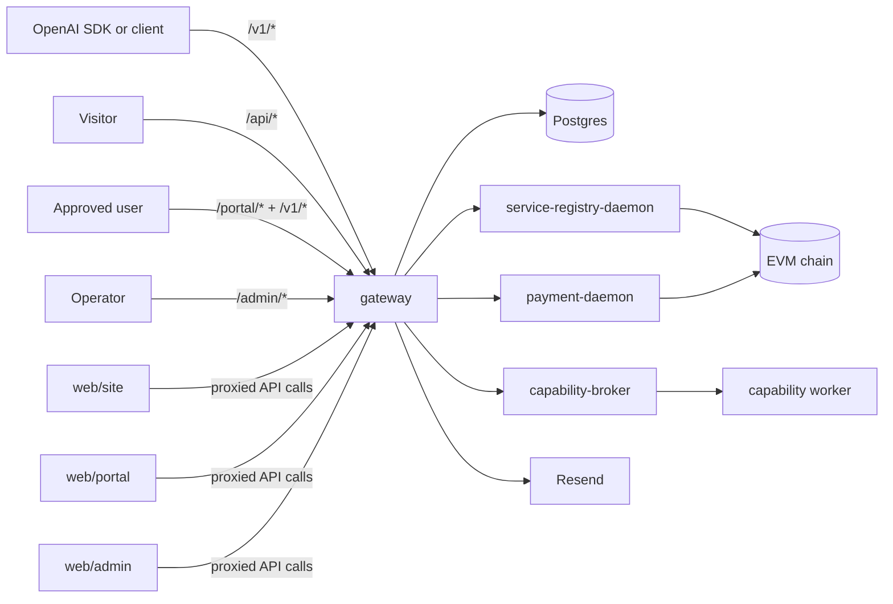
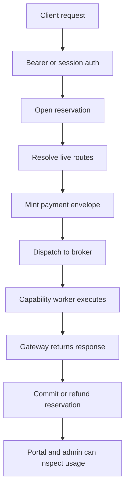
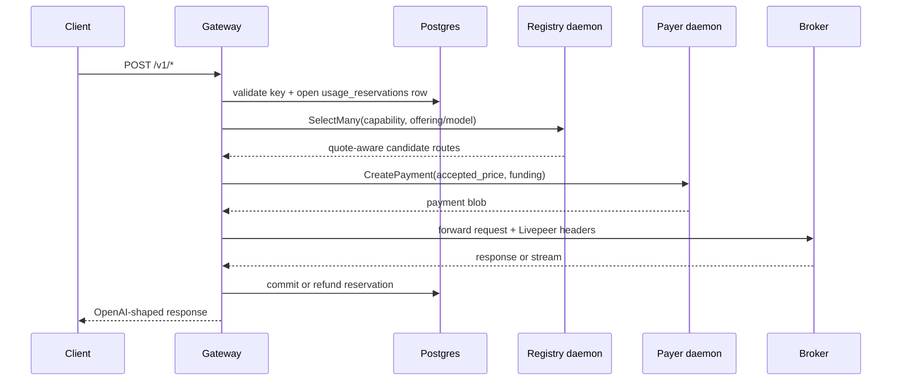
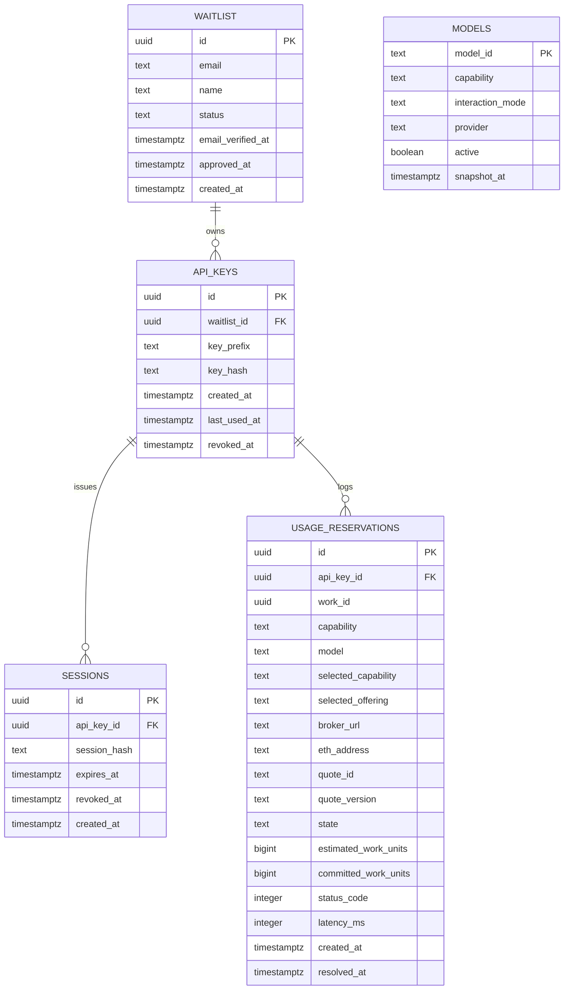

# OpenAI Service

An OpenAI-compatible inference gateway and SaaS shell built on top of
the [Livepeer](https://livepeer.org/) network and the
[livepeer-network-modules](https://github.com/Cloud-SPE/livepeer-network-modules)
framework.

This repository is both:
- a working application
- a reference implementation / demo of how to build against Livepeer
  network capabilities using the resolver, payer, and broker contract
  surfaces from `livepeer-network-modules`

The core idea is simple: keep the OpenAI client surface familiar, but
route work through Livepeer's on-chain capability marketplace with
proper quote-aware routing and payment minting.

Agents should start at [AGENTS.md](./AGENTS.md). Humans can use this
README as the main overview.

## What This Repo Is

This repo contains:
- `gateway/`: one TypeScript Fastify service that hosts:
  - the OpenAI-compatible `/v1/*` API
  - a waitlist / verify / approve / API-key shell
  - portal and admin backend routes
  - resolver and payer daemon clients
- `web/site/`: zero-build Lit marketing and waitlist site
- `web/portal/`: zero-build Lit user portal with account, keys, health,
  playground, and usage
- `web/admin/`: zero-build Lit admin with waitlist, users, usage,
  health, and registry diagnostics
- `proto/`: vendored gRPC contracts shared with the Livepeer daemons

This repo does not embed the Livepeer daemon implementations. It uses
the daemon stack exposed by `livepeer-network-modules`, especially:
- `service-registry-daemon`
- `payment-daemon`

## Why It Exists

This project demonstrates a practical application architecture for the
Livepeer network:
- discover capabilities from the on-chain registry
- select payment-ready routes from the resolver daemon
- mint per-request payment envelopes via the payer daemon
- forward OpenAI-shaped requests to capability brokers
- preserve enough quote / route metadata for auditing and debugging

It is intentionally opinionated:
- on-chain only
- no static overlay routing
- no unsigned-manifest mode
- no local hardcoded model catalog
- no local fallback broker path

## AI Harness Approach

This repo follows an agent-first harness model:
- the repository is the system of record
- plans live in the repo
- architecture is documented as executable invariants, not tribal lore
- the codebase is designed to be navigable by both humans and coding
  agents

The working style is:
- humans provide intent, constraints, and approval
- agents inspect the current repo state, make changes, run checks, and
  keep the work grounded in checked-in artifacts
- docs, code, and deployment surfaces are expected to move together

Relevant references:
- [AGENTS.md](./AGENTS.md)
- [docs/references/openai-harness-engineer.md](./docs/references/openai-harness-engineer.md)
- [docs/design-docs/core-beliefs.md](./docs/design-docs/core-beliefs.md)

## High-Level Architecture



## Data Flow



## Process Flow



## Data Model



## Repo Structure

| Path | Purpose |
|---|---|
| [gateway/](./gateway/) | TypeScript backend, routing, auth, usage tracking, daemon clients |
| [web/site/](./web/site/) | Marketing site and waitlist signup |
| [web/portal/](./web/portal/) | User portal and playground |
| [web/admin/](./web/admin/) | Operator/admin UI |
| [proto/](./proto/) | Vendored gRPC contracts |
| [docs/](./docs/) | Design docs, product specs, exec plans |

## Application Architecture

### Gateway responsibilities

The gateway is the center of the system. It:
- exposes OpenAI-compatible endpoints
- validates API keys and portal/admin credentials
- opens, commits, and refunds usage reservations
- selects live routes from `service-registry-daemon`
- mints payment envelopes through `payment-daemon`
- forwards requests to the selected capability broker
- stores a cached public model catalog in Postgres

### UI responsibilities

The three `web/` apps are zero-build Lit SPAs:
- `site`: onboarding and verification
- `portal`: user-facing account, keys, network health, playground, and
  usage
- `admin`: waitlist management, user inspection, usage, network health,
  and deep registry diagnostics

### Catalog vs hot-path routing

There are two distinct paths:
- hot-path routing:
  request-time resolver selection using `SelectMany`
- catalog/debug path:
  background refresh from `registryCatalog.inspect()` into the `models`
  table for `/v1/models` and diagnostics

That split is intentional. Request routing must stay live and
quote-aware. Public catalog reads must stay cheap and cacheable.

### Model identity

This gateway supports user-facing OpenAI `model` ids even when the
resolver's internal offering keys differ. On the hot path, the selector
can map a requested model id to one or more live offerings for the same
capability before dispatch.

### Supported API surface

Current v1 surface:
- `POST /v1/chat/completions`
- `POST /v1/embeddings`
- `POST /v1/images/generations`
- `POST /v1/audio/speech`
- `POST /v1/audio/transcriptions`
- `POST /v1/rerank`
- `GET /v1/models`

## Configuration

The runtime is env-driven. See [.env.example](./.env.example) for the
full manifest.

The main groups are:

### Gateway and URLs

- `BASE_URL`
- `PUBLIC_SITE_URL`
- `PUBLIC_PORTAL_URL`
- `ALLOWED_ORIGINS`
- `LOG_LEVEL`
- `GATEWAY_HOST_PORT`

### Postgres

- `POSTGRES_DB`
- `POSTGRES_USER`
- `POSTGRES_PASSWORD`
- `POSTGRES_HOST_PORT`

### SaaS shell secrets

- `ADMIN_TOKEN`
- `API_KEY_HASH_PEPPER`
- `IP_HASH_PEPPER`
- `METRICS_TOKEN`
- `SESSION_TTL_HOURS`

### Email

- `RESEND_API_KEY`
- `FROM_EMAIL`

### Livepeer daemon and chain configuration

- `CHAIN_RPC`
- `CHAIN_ID`
- `AI_SERVICE_REGISTRY_ADDRESS`
- `CONTROLLER_ADDRESS`
- `LIVEPEER_KEYSTORE_DIR`
- `LIVEPEER_REGISTRY_DAEMON_TAG`
- `LIVEPEER_PAYER_DAEMON_TAG`

### Refresh and rate limiting

- `REGISTRY_REFRESH_INTERVAL_MS`
- `V1_RATE_LIMIT_PER_MINUTE`
- `V1_RATE_LIMIT_BURST`

## Build

### Workspace build

```bash
pnpm install
make build
```

### Gateway-only checks

```bash
pnpm -F @livepeer-modules-openai/gateway lint
pnpm -F @livepeer-modules-openai/gateway test
```

### Container build

```bash
docker compose build gateway
```

## Quick Start

This is the shortest path to getting the stack up locally.

### 1. Clone and install

```bash
git clone <repo-url> livepeer-modules-openai
cd livepeer-modules-openai
pnpm install
```

### 2. Create local env

```bash
cp .env.example .env
```

Fill at least:
- `ADMIN_TOKEN`
- `API_KEY_HASH_PEPPER`
- `IP_HASH_PEPPER`
- `CHAIN_RPC`
- `AI_SERVICE_REGISTRY_ADDRESS`
- `LIVEPEER_KEYSTORE_DIR`

The repo is on-chain only. The gateway expects a real resolver daemon
and payer daemon stack.

### 3. Start the backend stack

```bash
docker compose --profile livepeer up -d --build
```

Check health:

```bash
curl http://localhost:4000/health
```

### 4. Start the web apps

One command:

```bash
make web
```

Or individually:

```bash
cd web/site && node dev-server.js
cd web/portal && node dev-server.js
cd web/admin && node dev-server.js
```

Default local ports:
- site: `http://localhost:3000`
- portal: `http://localhost:3001`
- admin: `http://localhost:3002`
- gateway: `http://localhost:4000`

Convenience targets:
- `make site-ui`
- `make portal-ui`
- `make admin-ui`

### 5. Verify the catalog

```bash
curl http://localhost:4000/v1/models
```

Important:
- `/v1/models` can return `503 models_cache_unavailable` briefly while
  the first registry refresh has not landed yet
- `/v1/models` can return `503 models_cache_stale` if the cached model
  snapshot is older than the allowed age

### 6. Run the smoke path

```bash
make smoke
```

## Local Development Notes

- migrations run automatically at gateway boot
- the portal and admin use their own session/token auth surfaces
- the playground uses the real `/v1/*` endpoints
- speech voice options are derived from published model metadata when a
  speech model advertises them
- admin and portal health are intentionally different:
  - portal: concise user-facing availability
  - admin: operator-facing capability and registry diagnostics

## Deployment

For production deployment, use [DEPLOYMENT.md](./DEPLOYMENT.md).

The important operational constraints are:
- daemon contracts must stay aligned with the gateway
- the DB migrations must run before serving traffic
- the payer keystore must exist and be funded appropriately
- resolver and payer sockets must be reachable by the gateway container
- public `/v1/models` depends on a fresh registry-backed cache

## What Else Is Worth Documenting

The repo is in decent shape, but the following additions would still add
value:
- a focused operator runbook for common failures:
  - stale model cache
  - resolver reachable but no candidates
  - payer reachable but payment minting failures
  - broker failures vs route failures
- a capability-by-capability product matrix:
  - request shape
  - interaction mode
  - work unit
  - expected model metadata
  - known caveats
- a glossary for:
  - capability
  - offering
  - model id
  - quote
  - route fingerprint
  - constraint fingerprint
- a troubleshooting page for local development:
  - socket permissions
  - keystore mounting
  - empty `/v1/models`
  - stale cache responses
  - portal/admin auth issues
- example OpenAI SDK snippets for:
  - chat
  - streaming chat
  - embeddings
  - speech
  - transcription
  - rerank

## Related Documents

- [AGENTS.md](./AGENTS.md)
- [DESIGN.md](./DESIGN.md)
- [ARCHITECTURE.md](./ARCHITECTURE.md)
- [DEPLOYMENT.md](./DEPLOYMENT.md)
- [PLANS.md](./PLANS.md)
- [docs/design-docs/index.md](./docs/design-docs/index.md)
- [docs/product-specs/index.md](./docs/product-specs/index.md)
